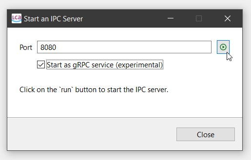
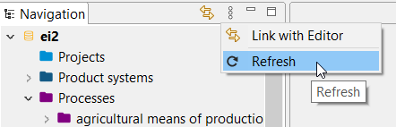
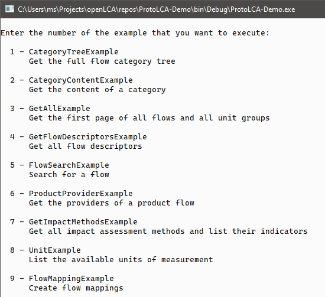

# ProtoLCA-Demo

This is a small C# example application that shows how to connect to openLCA 2
using a [gRPC](https://grpc.io/) client. It is a console application with which
you can run different examples. Each example is a C# class in this project.

## Usage

First you need to start an openLCA gRPC server. In openLCA 2, you can start such
a server with the currently active database via `Tools > Developer tools > IPC
Server` by checking the gRPC option:

The server will run until you click the stop button or close the dialog. You can
continue to work with the opened database while the server is running. Note that
in order to see updates of the gRPC client application in the database you may
have the refresh the navigation. You can do this via the `Refresh` button in the
navigation menu:

When the server is running, just start the demo application and follow the
instructions in the command prompt:

